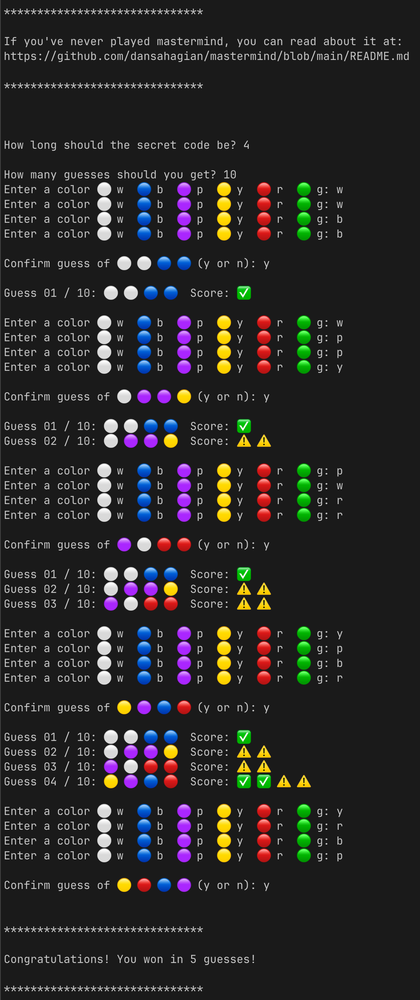

[](https://www.python.org/downloads/release/python-312/)

## Mastermind

This is a terminal version of the classic boardgame, Mastermind. I played this as a kid with my grandmother and wrote
this simple terminal version in 2018 for kicks. This game looks best on a dark terminal background. I might make this
configurable in a future commit. The instructions should work on macOS or Linux.

If you're using this code to learn and have any questions, feel free to reach out. You can find my Fosstodon and Website
on my GitHub profile.

### How to run the game:
The game doesn't have any dependencies outside the Python Core Library.  

Download and install Python3.12.  
https://www.python.org/downloads/

Clone the repo:  
```shell
git clone https://github.com/dansahagian/mastermind.git
```
Change into the directory:  
```shell
cd mastermind
```
Run the program:
```shell
./play
```

### How to change the code or run the tests:
Fork the repo:  
https://github.com/dansahagian/mastermind/fork

Clone your fork:
```shell
git clone <url-to-your-fork>
```
Install [uv](https://github.com/astral-sh/uv).

Install tools:
```shell
uv tool install ruff
uv tool install pre-commit
```

Initialize environment:
```shell
./dev/initialize-env
```

Run the tests:
```shell
uv run pytest .
```

### Rules of mastermind:
* You'll be asked how long of a sequence to generate.
  * The standard game is 4.
* You'll be asked how many guesses you should be allowed.
  * The standard game is 10.
* Your goal is to guess the sequence in that number of guesses.
* The game will ask you for your color sequence one at a time.
* It will ask you to confirm your guess before scoring it.

### Scoring:
* A ✅ means you have the correct color in the correct position.
* A ⚠️ means you have the correct color in the wrong position.
* The scoring pegs are sorted. They don't correlate to the position of your colors.

    #### Examples:
    In a 4 sequence game:
    * 4 ⚠️ means you have all the colors, but in the wrong positions.
    * 2 ✅ and 2 ⚠️ means you have all the colors right, but two are in the wrong position.

### Screenshots

